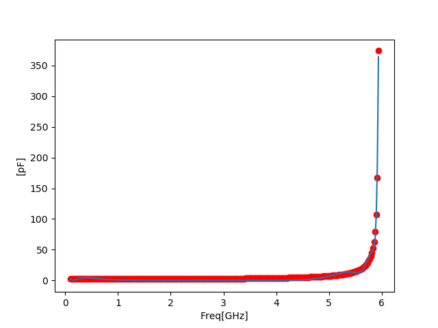

# simsurfing_converter
Approximate and Convert simsurfing data 

# independence
- numpy
- scipy
- matplotlib

# program
## approximater.py
```bash
$ python3 approximater data.csv -p
```

`-p` is plot option.

note : x data scale is changed to pico unit ( multiply 1e12 ) 


